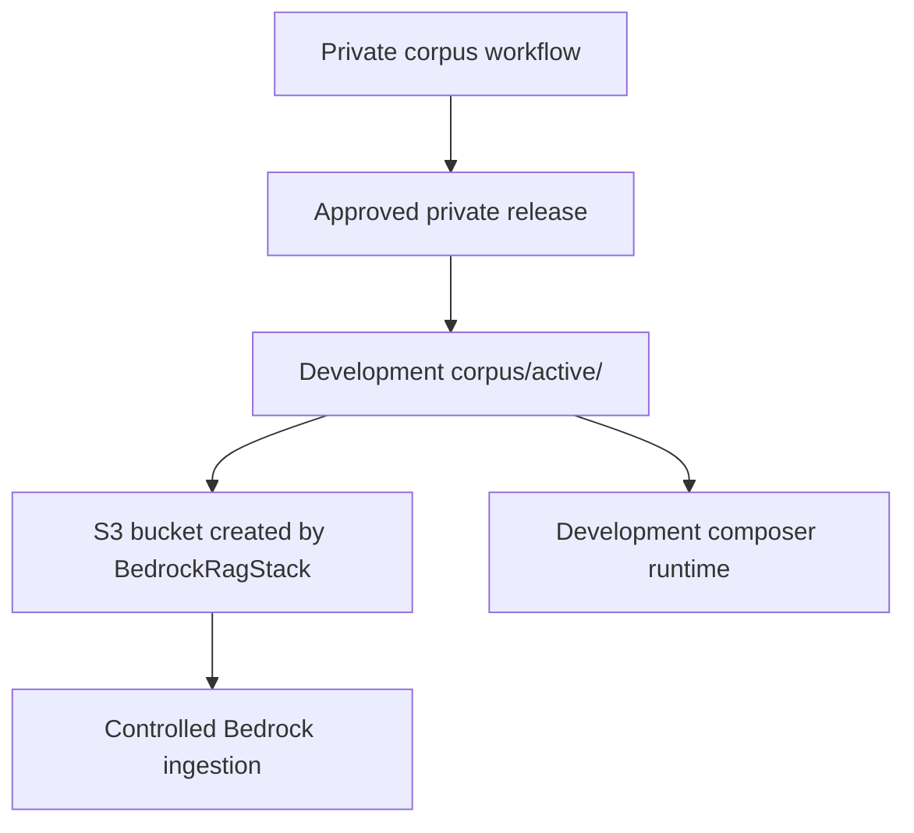

# Agent Reference: Bedrock RAG API

Use this when changing or debugging the Simple Tarot Bedrock reading path.
Also use this when changing authenticated reading persistence, because the
same `POST /readings` route now owns generation, DynamoDB writes, S3 API logs,
and profile updates.

Opaque composer loading and deterministic runtime composition are implemented for development.
Follow `docs/deterministic-composer-runtime.md`; do not infer or expand the runtime contract from
private artifact contents.

## Scope

The Bedrock path spans:

- `apps/api/src/routes/readings.ts`
- `apps/api/src/readings/*`
- `apps/api/src/bedrock/*`
- `apps/api/src/composer/*`
- `apps/api/src/config.ts`
- `apps/api/src/auth/*`
- `apps/api/src/logging/*`
- `apps/api/src/readings/persistence/*`
- `apps/infra/lib/api-stack.ts`
- `apps/infra/lib/bedrock-rag-stack.ts`
- `apps/infra/lib/config.ts`
- `apps/infra/lib/user-data-stack.ts`
- `apps/tarot/src/api/tarot-api.ts`
- `apps/tarot/src/readings/use-reading-history.ts`

Corpus sources, transformation code, relationship rules, generated artifacts, publication,
activation, and ingestion are private. The public repository owns Bedrock infrastructure and
runtime integration only.

The deployed API stack sets `BEDROCK_RUNTIME_MODE=bedrock` unconditionally and
receives the Knowledge Base ID, application inference profile ARN, and region
directly from `SimpleTarotBedrockRag-<env>` via CDK cross-stack references.
Development also receives the corpus bucket/data-source identities and runs with composer enabled.
Production is composer-disabled with no artifact-read grant.
There is no local-mode fallback in the deployed Lambda; local mode exists only
for offline API development (`yarn api:dev` without Bedrock env vars set).

## Runtime Decision

`getApiConfig().bedrock.mode` decides generation mode:

- `local`: default unless `BEDROCK_RUNTIME_MODE=bedrock`
- `bedrock`: requires region, Knowledge Base ID, and one model or inference
  profile setting

Model precedence in `apps/api/src/config.ts`:

1. `BEDROCK_INFERENCE_PROFILE_ARN`
2. `BEDROCK_INFERENCE_PROFILE_ID`
3. `BEDROCK_MODEL_ARN`
4. `BEDROCK_MODEL_ID`

`BEDROCK_MODEL_ID` is expanded into a foundation model ARN. Inference profile
IDs are passed through without ARN expansion.

## Request Path

```mermaid
flowchart LR
    Req["POST /readings"]
    Auth["Cognito user context"]
    Validate["validateReadingRequest"]
    Composer["load and compose active bundle"]
    Query["buildRetrievalQuery"]
    Retrieve["createKnowledgeBaseRetriever"]
    Evidence["buildRetrievalEvidence"]
    Prompt["buildExplicitGenerationPrompt"]
    Converse["createConverseGenerator"]
    Mode["getApiConfig().bedrock.mode"]
    Local["createLocalGeneratedReading"]
    Map["mapGeneratedReadingResponse"]
    Store["ReadingHistoryStore"]
    Logs["S3 API log sink"]

    Req --> Auth
    Auth --> Validate
    Validate --> Mode
    Mode --> Local
    Mode --> Composer
    Composer --> Query
    Query --> Retrieve
    Retrieve --> Evidence
    Evidence --> Prompt
    Composer --> Prompt
    Prompt --> Converse
    Local --> Map
    Converse --> Map
    Map --> Store
    Req --> Logs
```



Important files:

- Validation: `apps/api/src/readings/validation.ts`
- Local placeholder: `apps/api/src/readings/local-generated-reading.ts`
- Composer loading and deterministic context: `apps/api/src/composer/*`
- Enabled prompt: `apps/api/src/composer/prompt-builder.ts`
- Public contracts: `apps/api/src/readings/contracts.ts`
- Response mapping: `apps/api/src/readings/response-mapper.ts`
- Retrieval query: `apps/api/src/bedrock/retrieval-query-builder.ts`
- Active retrieval filter: `apps/api/src/bedrock/retrieval-filter.ts`
- Knowledge Base retrieval: `apps/api/src/bedrock/knowledge-base-retriever.ts`
- Evidence budgets: `apps/api/src/bedrock/retrieval-evidence.ts`
- Explicit RAG orchestration: `apps/api/src/bedrock/explicit-rag-generator.ts`
- Bedrock Converse: `apps/api/src/bedrock/converse-client.ts`
- Reading persistence: `apps/api/src/readings/persistence/*`
- API log sink: `apps/api/src/logging/api-log-sink.ts`

## Authenticated Persistence Path

Authenticated API requests use the Cognito `sub` claim as the application
`userId`. The mobile app sends a Cognito access token; it never receives
DynamoDB, S3, or Bedrock credentials.

`POST /readings`:

- persists successful readings to DynamoDB
- persists sanitized failed generation attempts to DynamoDB
- updates a minimal `PROFILE` item after successful saves
- writes request/diagnostic metadata to the S3 API log bucket when configured

`GET /readings` returns only successful readings for the signed-in user,
newest first. Failed attempts remain API/admin-only.

DynamoDB key shapes:

- profile: `pk = USER#<cognitoSub>`, `sk = PROFILE`
- successful reading: `pk = USER#<cognitoSub>`,
  `sk = READING#<createdAt>#<readingId>`
- failed attempt: `pk = USER#<cognitoSub>`,
  `sk = READING_ATTEMPT#<createdAt>#<requestId>`

Do not persist API metadata such as source IP, route, method, duration, or
user agent in DynamoDB. Those belong in the S3 API log source. Do not log
authorization headers, tokens, cookies, or full raw request bodies.

## Bedrock calls

`createExplicitRagReadingGenerator` performs exactly one retrieval and one generation boundary for
each successful Bedrock reading:

1. `buildRetrievalQuery` combines user intent with whole-spread and named-position themes.
2. `createKnowledgeBaseRetriever` sends `RetrieveCommand` with the Knowledge Base ID, five results
   by default, and an `andAll` filter for exact corpus version, approved status, and
   correspondence-theme document kind. No reranker is configured.
3. `buildRetrievalEvidence` omits empty text, caps each result at 2,000 characters, and caps the
   total at 8,000 characters.
4. `buildExplicitGenerationPrompt` places deterministic context before escaped, untrusted
   retrieved themes and user intent.
5. `createConverseGenerator` sends `ConverseCommand` through the configured inference profile with
   a 3,072-token maximum and temperature `0.7`.

Zero usable retrieval results still invoke Converse with deterministic context. Retrieval failure
prevents Converse. Retrieved evidence never enters responses, persistence, logs, or safe errors.
The generated result contains text, an empty citations array, and the configured model/profile ID.

Tests are colocated in `apps/api/src/bedrock/*.test.ts`.

The route reads the active pointer on every enabled request and validates/caches one immutable
bundle by complete pointer identity. It fails closed with safe 400/503 errors and never falls back
to the local placeholder while enabled. Response and persistence metadata contain aggregate composer
mode/version/counts only. See `docs/deterministic-composer-runtime.md`.

## Corpus Path



Do not add corpus-generation commands, private paths, relationship rules, or real artifact examples
to this public reference. The private workflow owns release publication, activation, ingestion,
and rollback. Follow `docs/bedrock_corpus_operations.md` for the public infrastructure boundary.

## Infra Path

`apps/infra/lib/bedrock-rag-stack.ts` creates:

- private versioned S3 corpus bucket
- S3 Vectors vector bucket (`AWS::S3Vectors::VectorBucket`)
- S3 Vectors index (`AWS::S3Vectors::Index`), `cosine` distance metric,
  `float32` data type, with the corpus's 8 custom metadata keys
  (`cardIndex`, `cardName`, `keywords`, `orientation`, `position`,
  `sourceCollection`, `sourcePath`, `spread`) marked non-filterable
- Bedrock Knowledge Base IAM role, granted `bedrock:InvokeModel` (embedding
  model) and the five `s3vectors:*` data-plane actions scoped to the index ARN
- Bedrock Knowledge Base (`storageConfiguration.type: S3_VECTORS`)
- environment-specific S3 data source: development uses `corpus/active/`, `NONE` chunking, and
  `DELETE`; production retains `corpus/`, `FIXED_SIZE` chunking at 200 max tokens / 20% overlap,
  and its existing logical identity
- CloudFormation outputs for API and operations handoff

OpenSearch Serverless (AOSS) was the original vector store and was fully
migrated away from on 2026-07-16 for cost (AOSS carries a fixed OCU-hour
floor; S3 Vectors is pure pay-per-use). No AOSS resources remain in this
stack. If you see AOSS mentioned elsewhere (older docs, git history), it's
describing the pre-migration architecture.

`apps/infra/lib/user-data-stack.ts` creates:

- DynamoDB user-data table with `pk` and `sk`
- S3 API log bucket under the API log source contract
- `UserDataTableName`, `UserDataTableArn`, `ApiLogBucketName`, and
  `ApiLogBucketArn` outputs

`apps/infra/lib/api-stack.ts` creates:

- Node.js 22 Lambda for `apps/api`, 29s timeout (API Gateway HTTP API's
  integration timeout is a hard, non-configurable 30s ceiling)
- API Gateway HTTP API with Cognito JWT authorizer — every route requires a
  valid JWT at the gateway layer; the API's own "unauthenticated reads
  permitted" logic is unreachable through the deployed URL, only via a direct
  Express run
- Lambda environment for Bedrock, user-data table, and API log bucket
- development-only `COMPOSER_RUNTIME_MODE=enabled`, corpus bucket, and data-source identities
- development-only `s3:GetObject` for the active pointer, release manifests, and composer bundles;
  production has none of these grants
- least-privilege permissions for DynamoDB and S3 API logs plus scoped Bedrock actions:
  `bedrock:Retrieve` on the Knowledge Base ARN, `bedrock:GetInferenceProfile` on the application
  inference profile ARN, and `bedrock:InvokeModel` on the profile and underlying foundation-model
  ARN
- `ApiUrl`, `ApiFunctionName`, and `ApiFunctionArn` outputs

**`ApiStack` consumes `BedrockRagStack`/`UserDataStack`/`CognitoStack`
resources with `ReferenceStrength.STRONG`** (`cdk.CrossStackReferences.of(this).consume(cdk.ReferenceStrength.STRONG)`,
first line of the constructor) — this uses real CloudFormation Export/Import,
not the CDK default `Fn::GetStackOutput`. Do not remove this: with the
default (weak) reference strength, a plain `cdk deploy` of `ApiStack` —
even with `--force` — reports "no changes" and silently leaves the Lambda
environment and IAM policy pointing at a stale/deleted value when a producer
stack replaces a consumed resource, because `Fn::GetStackOutput`'s own
arguments (stack name, output name) never change even though the value they
resolve to did. STRONG is safe here specifically because this project always
deploys `ApiStack` together with its dependency stacks in one `cdk deploy`
invocation.

`ApiUrl` is the mobile `EXPO_PUBLIC_TAROT_API_URL`. The current API is an
API Gateway HTTP API, so do not append a REST API stage path such as `/dev`
unless CloudFormation outputs one.

Defaults in `apps/infra/lib/config.ts`:

- stack name: `SimpleTarotBedrockRag-<environment>`
- KB name: `simple-tarot-<environment>-readings-v3`
- data source name: development `simple-tarot-dev-selective-corpus-v3`; production
  `simple-tarot-prod-corpus-v2`
- vector bucket name: `st-<environment>-vectors`
- vector index: `tarot-readings-v2`
- corpus prefix: development `corpus/active/`; production `corpus/`
- embedding model: `amazon.titan-embed-text-v2:0`
- embedding dimensions: `1024`
- generation model: `amazon.nova-lite-v1:0`

The suffixes on the KB, data source, and index names reflect required replacement cycles, not an
application compatibility contract. Nothing in the app references these names, only their
IDs/ARNs, so do not change them without expecting another replacement cycle.

## Mobile Handoff

The mobile app reads:

```sh
EXPO_PUBLIC_TAROT_API_URL=<ApiUrl output>
```

It calls `POST /readings` to generate and persist readings, and `GET /readings`
to fetch successful signed-in user history. Keep failed attempts hidden from
the user-facing history screen unless product requirements change.

## Verification Commands

Use focused tests after edits:

```sh
yarn workspace api test
yarn workspace api build-types
yarn workspace infra test
yarn workspace infra build-types
yarn workspace tarot test
yarn workspace tarot build-types
```

Infrastructure synth requires an explicit environment and its matching real
config file, for example:

```sh
yarn workspace infra cdk synth -c environment=dev 'SimpleTarotDev/*'
```

The command above loads the ignored `apps/infra/.env.dev` file.
