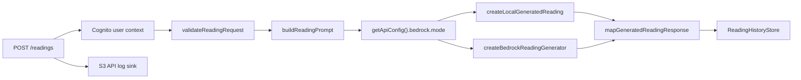
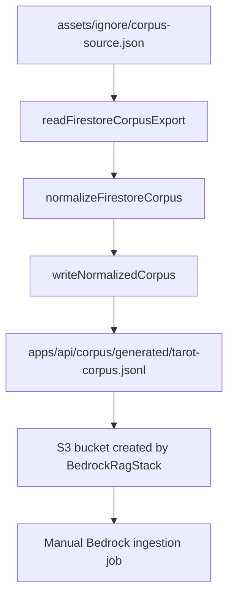

# Agent Reference: Bedrock RAG API

Use this when changing or debugging the Simple Tarot Bedrock reading path.
Also use this when changing authenticated reading persistence, because the
same `POST /readings` route now owns generation, DynamoDB writes, S3 API logs,
and profile updates.

## Scope

The Bedrock path spans:

- `apps/api/src/routes/readings.ts`
- `apps/api/src/readings/*`
- `apps/api/src/bedrock/*`
- `apps/api/src/config.ts`
- `apps/api/src/auth/*`
- `apps/api/src/corpus/*`
- `apps/api/src/logging/*`
- `apps/api/src/readings/persistence/*`
- `apps/api/scripts/normalize-corpus.ts`
- `apps/infra/lib/api-stack.ts`
- `apps/infra/lib/bedrock-rag-stack.ts`
- `apps/infra/lib/config.ts`
- `apps/infra/lib/user-data-stack.ts`
- `apps/tarot/src/api/tarot-api.ts`
- `apps/tarot/src/readings/use-reading-history.ts`

Do not assume the S3 corpus upload or Bedrock ingestion sync is automated.
Only normalization is currently automated in this repo.

The deployed API stack currently sets `BEDROCK_RUNTIME_MODE=local` so the
authenticated persistence flow can run while Bedrock model access is pending.
When Bedrock access is approved, update the API Lambda environment to
`BEDROCK_RUNTIME_MODE=bedrock`, confirm corpus ingestion, and update response
metadata so Bedrock-generated readings persist `metadata.mode = bedrock`.

## Runtime Decision

`getApiConfig().bedrock.mode` decides generation mode:

- `local`: default unless `BEDROCK_RUNTIME_MODE=bedrock`
- `bedrock`: requires region, Knowledge Base ID, and one model or inference
  profile setting

Model precedence in `apps/api/src/config.ts`:

1. `BEDROCK_INFERENCE_PROFILE_ARN`
2. `BEDROCK_INFERENCE_PROFILE_ID`
3. `BEDROCK_MODEL_ARN`
4. `BEDROCK_MODEL_ID`

`BEDROCK_MODEL_ID` is expanded into a foundation model ARN. Inference profile
IDs are passed through without ARN expansion.

## Request Path



Important files:

- Validation: `apps/api/src/readings/validation.ts`
- Prompt: `apps/api/src/readings/prompt-builder.ts`
- Public contracts: `apps/api/src/readings/contracts.ts`
- Response mapping: `apps/api/src/readings/response-mapper.ts`
- Bedrock runtime call: `apps/api/src/bedrock/bedrock-client.ts`
- Reading persistence: `apps/api/src/readings/persistence/*`
- API log sink: `apps/api/src/logging/api-log-sink.ts`

Known caveat: `mapGeneratedReadingResponse` currently hard-codes
`metadata.mode` as `local`, even for Bedrock-generated text.

## Authenticated Persistence Path

Authenticated API requests use the Cognito `sub` claim as the application
`userId`. The mobile app sends a Cognito access token; it never receives
DynamoDB, S3, or Bedrock credentials.

`POST /readings`:

- persists successful readings to DynamoDB
- persists sanitized failed generation attempts to DynamoDB
- updates a minimal `PROFILE` item after successful saves
- writes request/diagnostic metadata to the S3 API log bucket when configured

`GET /readings` returns only successful readings for the signed-in user,
newest first. Failed attempts remain API/admin-only.

DynamoDB key shapes:

- profile: `pk = USER#<cognitoSub>`, `sk = PROFILE`
- successful reading: `pk = USER#<cognitoSub>`,
  `sk = READING#<createdAt>#<readingId>`
- failed attempt: `pk = USER#<cognitoSub>`,
  `sk = READING_ATTEMPT#<createdAt>#<requestId>`

Do not persist API metadata such as source IP, route, method, duration, or
user agent in DynamoDB. Those belong in the S3 API log source. Do not log
authorization headers, tokens, cookies, or full raw request bodies.

## Bedrock Call

`createBedrockReadingGenerator` sends `RetrieveAndGenerateCommand` with:

- `retrieveAndGenerateConfiguration.type = KNOWLEDGE_BASE`
- `knowledgeBaseConfiguration.knowledgeBaseId`
- `knowledgeBaseConfiguration.modelArn`
- `vectorSearchConfiguration.numberOfResults`
- `input.text = prompt`

It returns:

- `text`: `output.output?.text ?? ''`
- `citations`: flattened retrieved references from `output.citations`
- `modelId`: configured model ARN or inference profile value

Tests are in `apps/api/src/bedrock/bedrock-client.test.ts`.

## Corpus Path



Command:

```sh
yarn workspace api corpus:normalize
```

The script accepts optional source and output directory args:

```sh
yarn workspace api corpus:normalize <source-json-path> <output-directory>
```

Generated record types:

- `card-context`
- `position-meaning`

Generated metadata fields:

- `cardIndex`
- `cardName`
- `keywords`
- `orientation`
- `position`
- `sourceCollection`
- `sourcePath`
- `spread`

## Infra Path

`apps/infra/lib/bedrock-rag-stack.ts` creates:

- private versioned S3 corpus bucket
- OpenSearch Serverless vector collection
- security and data access policies
- vector index with fields `bedrock-vector`, `bedrock-text`,
  `bedrock-metadata`
- Bedrock Knowledge Base IAM role
- Bedrock Knowledge Base
- S3 data source with configured inclusion prefix
- CloudFormation outputs for API and operations handoff

`apps/infra/lib/user-data-stack.ts` creates:

- DynamoDB user-data table with `pk` and `sk`
- S3 API log bucket under the API log source contract
- `UserDataTableName`, `UserDataTableArn`, `ApiLogBucketName`, and
  `ApiLogBucketArn` outputs

`apps/infra/lib/api-stack.ts` creates:

- Node.js 22 Lambda for `apps/api`
- API Gateway HTTP API with Cognito JWT authorizer
- Lambda environment for Bedrock, user-data table, and API log bucket
- least-privilege permissions for DynamoDB, S3 API logs, and Bedrock
- `ApiUrl`, `ApiFunctionName`, and `ApiFunctionArn` outputs

`ApiUrl` is the mobile `EXPO_PUBLIC_TAROT_API_URL`. The current API is an
API Gateway HTTP API, so do not append a REST API stage path such as `/dev`
unless CloudFormation outputs one.

Defaults in `apps/infra/lib/config.ts`:

- stack name: `SimpleTarotBedrockRag-<environment>`
- KB name: `simple-tarot-<environment>-readings`
- data source name: `simple-tarot-<environment>-corpus`
- collection name: `st-<environment>-rag`
- vector index: `tarot-readings`
- corpus prefix: `corpus/`
- embedding model: `amazon.titan-embed-text-v2:0`
- embedding dimensions: `1024`
- generation model: `global.anthropic.claude-sonnet-4-5-20250929-v1:0`

## Mobile Handoff

The mobile app reads:

```sh
EXPO_PUBLIC_TAROT_API_URL=<ApiUrl output>
```

It calls `POST /readings` to generate and persist readings, and `GET /readings`
to fetch successful signed-in user history. Keep failed attempts hidden from
the user-facing history screen unless product requirements change.

## Verification Commands

Use focused tests after edits:

```sh
yarn workspace api test
yarn workspace api build-types
yarn workspace infra test
yarn workspace infra build-types
yarn workspace tarot test
yarn workspace tarot build-types
```

Infrastructure synth requires an explicit environment and its matching real
config file, for example:

```sh
yarn workspace infra cdk synth -c environment=dev 'SimpleTarotDev/*'
```

The command above loads the ignored `apps/infra/.env.dev` file.
