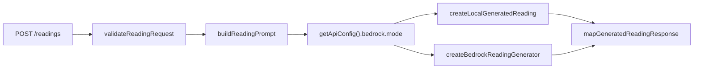
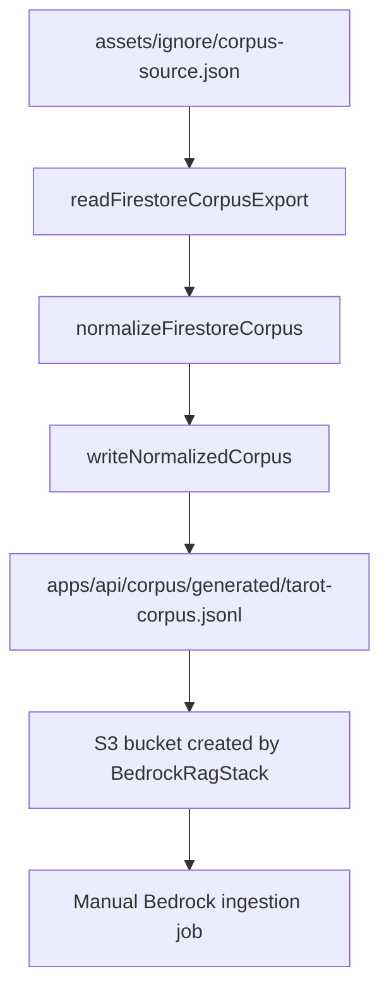

# Agent Reference: Bedrock RAG API

Use this when changing or debugging the Simple Tarot Bedrock reading path.

## Scope

The Bedrock path spans:

- `apps/api/src/routes/readings.ts`
- `apps/api/src/readings/*`
- `apps/api/src/bedrock/*`
- `apps/api/src/config.ts`
- `apps/api/src/corpus/*`
- `apps/api/scripts/normalize-corpus.ts`
- `apps/infra/lib/bedrock-rag-stack.ts`
- `apps/infra/lib/config.ts`

Do not assume the S3 corpus upload or Bedrock ingestion sync is automated.
Only normalization is currently automated in this repo.

## Runtime Decision

`getApiConfig().bedrock.mode` decides generation mode:

- `local`: default unless `BEDROCK_RUNTIME_MODE=bedrock`
- `bedrock`: requires region, Knowledge Base ID, and one model or inference
  profile setting

Model precedence in `apps/api/src/config.ts`:

1. `BEDROCK_INFERENCE_PROFILE_ARN`
2. `BEDROCK_INFERENCE_PROFILE_ID`
3. `BEDROCK_MODEL_ARN`
4. `BEDROCK_MODEL_ID`

`BEDROCK_MODEL_ID` is expanded into a foundation model ARN. Inference profile
IDs are passed through without ARN expansion.

## Request Path



Important files:

- Validation: `apps/api/src/readings/validation.ts`
- Prompt: `apps/api/src/readings/prompt-builder.ts`
- Public contracts: `apps/api/src/readings/contracts.ts`
- Response mapping: `apps/api/src/readings/response-mapper.ts`
- Bedrock runtime call: `apps/api/src/bedrock/bedrock-client.ts`

Known caveat: `mapGeneratedReadingResponse` currently hard-codes
`metadata.mode` as `local`, even for Bedrock-generated text.

## Bedrock Call

`createBedrockReadingGenerator` sends `RetrieveAndGenerateCommand` with:

- `retrieveAndGenerateConfiguration.type = KNOWLEDGE_BASE`
- `knowledgeBaseConfiguration.knowledgeBaseId`
- `knowledgeBaseConfiguration.modelArn`
- `vectorSearchConfiguration.numberOfResults`
- `input.text = prompt`

It returns:

- `text`: `output.output?.text ?? ''`
- `citations`: flattened retrieved references from `output.citations`
- `modelId`: configured model ARN or inference profile value

Tests are in `apps/api/src/bedrock/bedrock-client.test.ts`.

## Corpus Path



Command:

```sh
yarn workspace api corpus:normalize
```

The script accepts optional source and output directory args:

```sh
yarn workspace api corpus:normalize <source-json-path> <output-directory>
```

Generated record types:

- `card-context`
- `position-meaning`

Generated metadata fields:

- `cardIndex`
- `cardName`
- `keywords`
- `orientation`
- `position`
- `sourceCollection`
- `sourcePath`
- `spread`

## Infra Path

`apps/infra/lib/bedrock-rag-stack.ts` creates:

- private versioned S3 corpus bucket
- OpenSearch Serverless vector collection
- security and data access policies
- vector index with fields `bedrock-vector`, `bedrock-text`,
  `bedrock-metadata`
- Bedrock Knowledge Base IAM role
- Bedrock Knowledge Base
- S3 data source with configured inclusion prefix
- CloudFormation outputs for API and operations handoff

Defaults in `apps/infra/lib/config.ts`:

- stack name: `SimpleTarotBedrockRag-<environment>`
- KB name: `simple-tarot-<environment>-readings`
- data source name: `simple-tarot-<environment>-corpus`
- collection name: `st-<environment>-rag`
- vector index: `tarot-readings`
- corpus prefix: `corpus/`
- embedding model: `amazon.titan-embed-text-v2:0`
- embedding dimensions: `1024`
- generation model: `global.anthropic.claude-sonnet-4-5-20250929-v1:0`

## Verification Commands

Use focused tests after edits:

```sh
yarn workspace api test
yarn workspace api build-types
yarn workspace infra test
yarn workspace infra build-types
```

`yarn workspace infra cdk synth` requires a real `apps/infra/.env`.
