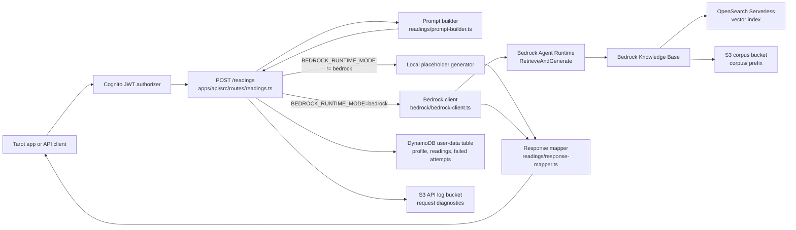
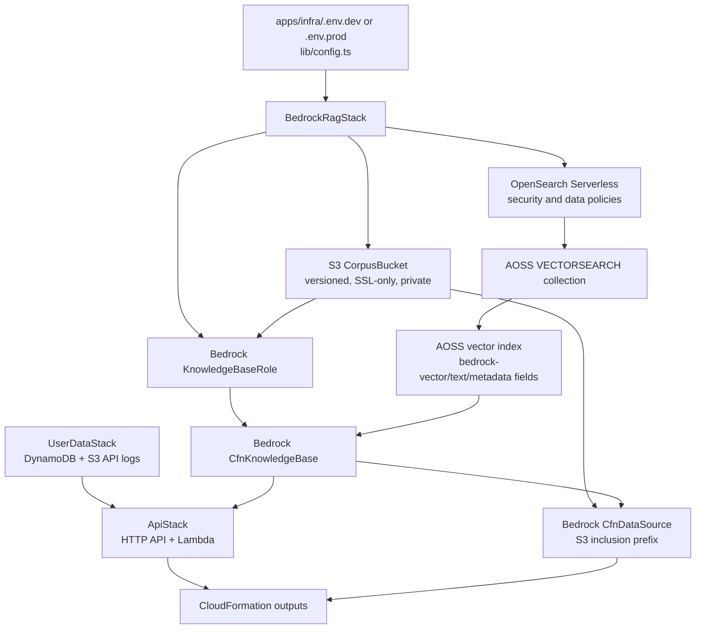
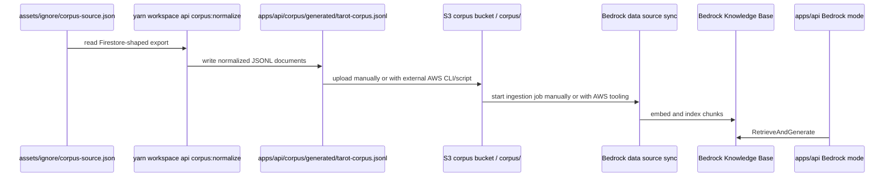

# Bedrock RAG API Integration

This document explains how the Simple Tarot API connects tarot reading
requests to an Amazon Bedrock Knowledge Base backed by normalized corpus
documents in S3.

## Purpose

The Bedrock RAG work adds a REST API path for generated tarot readings:

- `apps/api` receives reading requests and builds a deterministic retrieval
  prompt. Authenticated requests also persist reading history through the API's
  user-data store.
- `apps/infra` deploys the Bedrock Knowledge Base dependencies: S3, OpenSearch
  Serverless, IAM, Bedrock data source resources, the user-data table, the API
  log bucket, and the API Gateway/Lambda runtime.
- A normalized corpus JSONL file is generated from the Firestore-shaped tarot
  source export for Knowledge Base ingestion.

The API can run in local placeholder mode or Bedrock mode. Local mode is the
default so developers can run the API without AWS credentials.

## Architecture



## API Runtime Flow

`POST /readings` is defined in `apps/api/src/routes/readings.ts`.

The route:

1. Validates the request body with `validateReadingRequest`.
2. Builds a prompt with `buildReadingPrompt`.
3. Reads `getApiConfig().bedrock`.
4. Uses the local placeholder generator unless `BEDROCK_RUNTIME_MODE=bedrock`.
5. Calls Bedrock `RetrieveAndGenerate` in Bedrock mode.
6. Maps generated text and citations into the public reading response.
7. Persists authenticated successful readings and minimal profile updates.
8. Persists authenticated failed generation attempts with sanitized failure
   fields.
9. Writes request/diagnostic metadata to the S3 API log bucket when configured.

`GET /readings` returns only the signed-in user's successful readings, newest
first. Failed generation attempts are persisted for support/admin use but are
not returned to the mobile app history screen.

The request contract lives in `apps/api/src/readings/contracts.ts`.

Required request fields:

- `spread`: non-empty string.
- `items`: at least one ordered card item.
- `items[].cardIndex`: number.
- `items[].cardName`: non-empty string.
- `items[].position`: non-empty string.
- `items[].reversed`: boolean.
- `question`: optional string.

## Prompt Grounding

`apps/api/src/readings/prompt-builder.ts` builds a prompt that includes:

- spread name
- optional user question
- ordered card list
- card index
- card position
- upright or reversed orientation

The prompt instructs Bedrock to ground the reading only in retrieved corpus
context, respect position and orientation, and avoid inventing source material.

## Bedrock Client

`apps/api/src/bedrock/bedrock-client.ts` wraps
`@aws-sdk/client-bedrock-agent-runtime`.

It sends a `RetrieveAndGenerateCommand` with:

- `type: KNOWLEDGE_BASE`
- configured Knowledge Base ID
- configured generation model ARN or inference profile ID/ARN
- configured vector search result count
- prompt text as `input.text`

It maps Bedrock retrieved references into API citations:

- `sourceId`: S3 URI, web URL, supported connector URL, location type, or
  `bedrock-reference`
- `text`: retrieved reference content text
- `metadata`: Bedrock reference metadata

The client logs start, success, and failure events with request ID, model,
Knowledge Base ID, prompt length, retrieval count, citation count, and text
length where available.

## Runtime Configuration

API configuration lives in `apps/api/src/config.ts` and is loaded from
environment variables at startup in `apps/api/src/index.ts`.

Local mode:

```sh
BEDROCK_RUNTIME_MODE=local
```

Bedrock mode:

```sh
BEDROCK_RUNTIME_MODE=bedrock
BEDROCK_REGION=us-east-1
BEDROCK_KNOWLEDGE_BASE_ID=<BedrockKnowledgeBaseId output>
BEDROCK_INFERENCE_PROFILE_ID=global.anthropic.claude-sonnet-4-5-20250929-v1:0
BEDROCK_MAX_ATTEMPTS=5
BEDROCK_RETRIEVAL_RESULTS=5
```

Model selection precedence:

1. `BEDROCK_INFERENCE_PROFILE_ARN`
2. `BEDROCK_INFERENCE_PROFILE_ID`
3. `BEDROCK_MODEL_ARN`
4. `BEDROCK_MODEL_ID`

When `BEDROCK_MODEL_ID` is set, the API expands it into a regional foundation
model ARN. Inference profile IDs and ARNs are passed through as provided.

The deployed API stack currently sets `BEDROCK_RUNTIME_MODE=local` without
Bedrock resource identifiers, model settings, or IAM permission. This keeps the
Bedrock stack independently manageable. When activating Bedrock, confirm
Knowledge Base ingestion, restore the Knowledge Base/region/model environment
handoff and scoped `bedrock:RetrieveAndGenerate` permission, change the mode to
`bedrock`, and redeploy the API stack.

## Infrastructure Flow

`apps/infra/bin/simple-tarot-infra.ts` creates the Cognito, user-data, Bedrock
RAG, and API stacks. The Bedrock stack is implemented in
`apps/infra/lib/bedrock-rag-stack.ts`; user-data and API runtime resources live
in `apps/infra/lib/user-data-stack.ts` and `apps/infra/lib/api-stack.ts`.



The stack creates:

- S3 bucket for normalized corpus artifacts.
- OpenSearch Serverless vector search collection.
- OpenSearch Serverless encryption, network, and data access policies.
- OpenSearch Serverless vector index.
- IAM role assumed by Bedrock.
- Bedrock Knowledge Base using the configured embedding model.
- S3 data source scoped to the configured corpus prefix.
- DynamoDB user-data table for profile, reading history, and failed attempts.
- S3 API log bucket for request diagnostics that should not live in DynamoDB.
- API Gateway HTTP API + Lambda runtime with Cognito JWT authorization.
- CloudFormation outputs needed by the API, mobile app, and corpus operations.

Development environments use destroy removal policy and auto-delete bucket
objects. Production uses retain removal policy.

## Corpus Lifecycle



Normalization is automated. Upload and ingestion sync are not currently
implemented as repo scripts.

Current automated command:

```sh
yarn workspace api corpus:normalize
```

Default input:

```text
assets/ignore/corpus-source.json
```

Default output:

```text
apps/api/corpus/generated/tarot-corpus.jsonl
```

The Bedrock stack creates the bucket and data source but does not upload local
documents into S3 and does not start a Knowledge Base ingestion job. Before API
calls can retrieve real corpus context, upload the generated JSONL file under
the configured prefix, then sync the Bedrock data source.

Example AWS CLI shape:

```sh
aws s3 cp apps/api/corpus/generated/tarot-corpus.jsonl \
  s3://<BedrockCorpusBucketName>/corpus/tarot-corpus.jsonl

aws bedrock-agent start-ingestion-job \
  --knowledge-base-id <BedrockKnowledgeBaseId> \
  --data-source-id <BedrockDataSourceId>
```

Use the configured `SIMPLE_TAROT_BEDROCK_CORPUS_PREFIX` instead of `corpus/`
when that value is changed.

## Integration Outputs

After deploying the Bedrock RAG stack, copy CloudFormation outputs into a
direct local API runtime when testing Bedrock mode. The deployed local-mode
Lambda intentionally does not consume these outputs until Bedrock activation:

| CloudFormation output | API env var |
| --- | --- |
| `BedrockKnowledgeBaseId` | `BEDROCK_KNOWLEDGE_BASE_ID` |
| `BedrockRegion` | `BEDROCK_REGION` |
| `BedrockGenerationModelId` | `BEDROCK_INFERENCE_PROFILE_ID` or model env |
| `BedrockCorpusBucketName` | upload target, not read by current API |
| `BedrockDataSourceId` | ingestion sync target, not read by current API |

For local authenticated persistence runs, also copy:

| CloudFormation output | API env var |
| --- | --- |
| `UserDataTableName` | `USER_DATA_TABLE_NAME` |
| `ApiLogBucketName` | `API_LOG_BUCKET_NAME` |
| `CognitoIssuer` | `COGNITO_ISSUER` |
| `CognitoUserPoolClientId` | `COGNITO_CLIENT_ID` |

For the mobile app, copy `ApiUrl` to `EXPO_PUBLIC_TAROT_API_URL`. The current
API Gateway resource is an HTTP API, so the URL does not include a `/dev` REST
stage path unless CloudFormation outputs one.

## Known Caveats

- The repo currently has normalization automation only. Uploading corpus files
  and starting Bedrock ingestion are manual or external-script operations.
- `apps/api/src/readings/response-mapper.ts` currently sets response
  `metadata.mode` to `local` regardless of whether the generated text came from
  Bedrock. Before enabling Bedrock mode in production, update this so persisted
  `ReadingResponse.metadata.mode` can record `bedrock`.
- The OpenSearch Serverless network policy currently allows public access for
  MVP ingestion simplicity. Revisit this when the API deployment topology is
  settled.
- The API creates a Bedrock runtime client per request path invocation through
  `createBedrockReadingGenerator`. That is simple and testable, but not yet
  optimized as a long-lived singleton.

## Verification Commands

```sh
yarn workspace api test
yarn workspace api build-types
yarn workspace infra test
yarn workspace infra build-types
```

Infrastructure synth requires an explicit environment and its populated
matching config file. For dev:

```sh
yarn workspace infra cdk synth -c environment=dev 'SimpleTarotDev/*'
```
