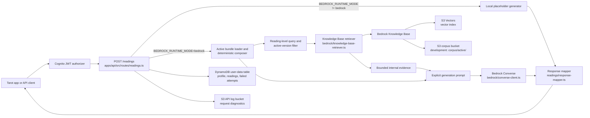
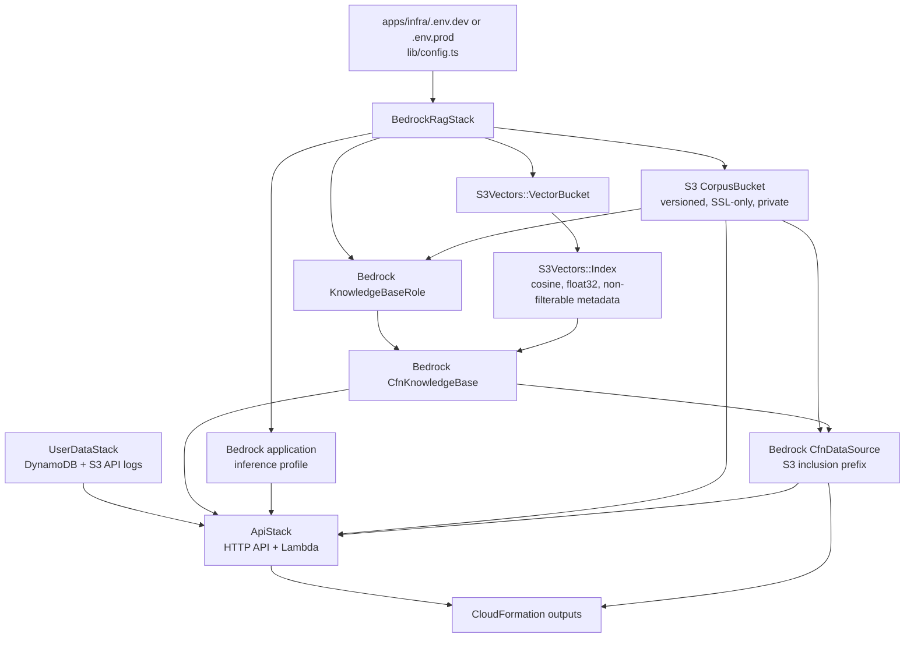
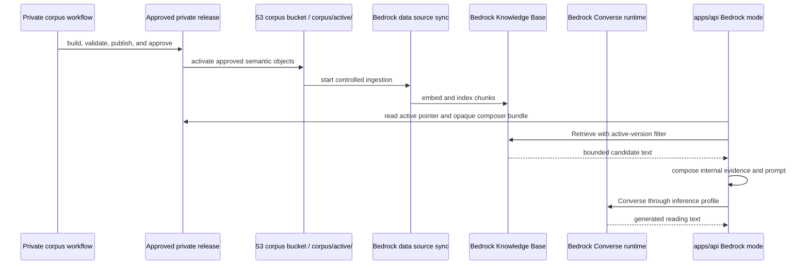

# Bedrock RAG API Integration

This document explains how the Simple Tarot API connects tarot reading
requests to an Amazon Bedrock Knowledge Base backed by private corpus artifacts in S3.

## Purpose

The Bedrock RAG work adds a REST API path for generated tarot readings:

- `apps/api` receives reading requests, loads the approved active composer bundle in development,
  composes exact context, and builds a deterministic prompt. Authenticated requests also persist
  reading history through the API's user-data store.
- `apps/infra` deploys the Bedrock Knowledge Base dependencies: S3, S3
  Vectors, IAM, Bedrock data source resources, the user-data table, the API
  log bucket, and the API Gateway/Lambda runtime.
- Approved corpus artifacts are produced through a private workflow and handed to public AWS
  operations for Knowledge Base ingestion.

See [Private Corpus Artifact Boundary](private-corpus-artifact-boundary.md) for the durable
ownership and compatibility contract. This integration document describes only the public AWS and
runtime side of that boundary.

The deployed API runs in Bedrock mode in `us-east-2`. Local placeholder mode
remains available explicitly for offline development without AWS credentials.

## Architecture



## API Runtime Flow

`POST /readings` is defined in `apps/api/src/routes/readings.ts`.

The route:

1. Validates the request body with `validateReadingRequest`.
2. Uses the offline placeholder generator without S3 access in local mode.
3. In enabled mode, reads the active pointer, validates or reuses one immutable bundle snapshot,
   and composes exact card and relationship context.
4. Builds one reading-level retrieval query and the exact active-version retrieval filter.
5. Requests five Knowledge Base results without a reranker and reduces usable text to bounded
   internal evidence.
6. Builds the precedence-ordered explicit generation prompt.
7. Calls Bedrock Converse through the configured application inference profile. If retrieval
   succeeds with zero usable results, this call still uses deterministic context alone.
8. Maps generated text plus aggregate composer metadata into the public response; citations remain
   an empty array because retrieval evidence is internal.
9. Persists authenticated successful readings and minimal profile updates.
10. Persists authenticated failed generation attempts with sanitized failure fields.
11. Writes request/diagnostic metadata to the S3 API log bucket when configured.

See [Deterministic Composer Runtime](deterministic-composer-runtime.md) for loader, composition,
error, metadata, and rollback details.

`GET /readings` returns only the signed-in user's successful readings, newest
first. Failed generation attempts are persisted for support/admin use but are
not returned to the mobile app history screen.

The request contract lives in `apps/api/src/readings/contracts.ts`.

Required request fields:

- `spread`: non-empty string.
- `items`: at least one ordered card item.
- `items[].cardIndex`: number.
- `items[].cardName`: non-empty string.
- `items[].position`: non-empty string.
- `items[].reversed`: boolean.
- `question`: optional string.

## Prompt Grounding

Enabled development uses `apps/api/src/composer/prompt-builder.ts`, which orders:

- authority and non-contradiction instructions
- active corpus and spread identity
- ordered exact card, orientation, and position context
- named positional relationships
- whole-spread relationships
- optional bounded retrieved themes
- user intent
- response requirements

Retrieved text may enrich the exact context but cannot replace or contradict it. Private source and
rule IDs are not rendered.

## Explicit retrieval and generation

`apps/api/src/bedrock/explicit-rag-generator.ts` coordinates small focused boundaries:

- `retrieval-query-builder.ts` combines the user question or general intent with whole-spread and
  named-position themes into one reading-level query.
- `retrieval-filter.ts` requires the exact active corpus version, approved status, and
  correspondence-theme document kind.
- `knowledge-base-retriever.ts` sends one `RetrieveCommand` for five results by default. No
  reranker is configured.
- `retrieval-evidence.ts` omits empty text, caps each result at 2,000 characters, and caps total
  evidence at 8,000 characters.
- `composer/prompt-builder.ts` places authoritative deterministic context before escaped retrieved
  themes and user intent.
- `converse-client.ts` sends one `ConverseCommand` through the configured application inference
  profile with a 3,072-token maximum and temperature `0.7`.

Retrieval evidence is untrusted, prompt-only data. It does not enter API responses, persistence,
logs, or safe errors. Retrieval success with zero usable evidence still reaches Converse;
retrieval failure does not. The Converse client returns generated text and an empty citations
array.

Boundary logs contain request ID, timing, configured resource identity, counts, prompt lengths,
token usage, output length, and stop reason. They do not contain queries, retrieved evidence,
prompts, or generated text.

## Runtime Configuration

API configuration lives in `apps/api/src/config.ts` and is loaded from
environment variables at startup in `apps/api/src/index.ts`.

Local mode:

```sh
BEDROCK_RUNTIME_MODE=local
```

Bedrock mode:

```sh
BEDROCK_RUNTIME_MODE=bedrock
BEDROCK_REGION=us-east-2
BEDROCK_KNOWLEDGE_BASE_ID=<BedrockKnowledgeBaseId output>
BEDROCK_INFERENCE_PROFILE_ARN=<BedrockInferenceProfileArn output>
BEDROCK_MAX_ATTEMPTS=5
BEDROCK_RETRIEVAL_RESULTS=5
COMPOSER_RUNTIME_MODE=enabled
BEDROCK_CORPUS_BUCKET=<BedrockCorpusBucketName output>
BEDROCK_DATA_SOURCE_ID=<BedrockDataSourceId output>
```

Model selection precedence:

1. `BEDROCK_INFERENCE_PROFILE_ARN`
2. `BEDROCK_INFERENCE_PROFILE_ID`
3. `BEDROCK_MODEL_ARN`
4. `BEDROCK_MODEL_ID`

When `BEDROCK_MODEL_ID` is set, the API expands it into a regional foundation
model ARN. Inference profile IDs and ARNs are passed through as provided.

The deployed API stack sets `BEDROCK_RUNTIME_MODE=bedrock` unconditionally,
imports the Knowledge Base ID, `us-east-2` region, and application inference
profile ARN from the Bedrock stack. The Lambda role has `bedrock:Retrieve` on
the Knowledge Base ARN, `bedrock:GetInferenceProfile` on the application
inference profile ARN, and `bedrock:InvokeModel` on the profile plus underlying
foundation-model ARN. Corpus upload and Knowledge Base ingestion must complete
before retrieval can return approved private context.

Development sets composer mode enabled and grants only the three approved object-read patterns.
Local mode disables composer automatically. Production is composer-disabled and has no composer
artifact-read grant.

## Infrastructure Flow

`apps/infra/bin/simple-tarot-infra.ts` creates the Cognito, user-data, Bedrock
RAG, and API stacks. The Bedrock stack is implemented in
`apps/infra/lib/bedrock-rag-stack.ts`; user-data and API runtime resources live
in `apps/infra/lib/user-data-stack.ts` and `apps/infra/lib/api-stack.ts`.



The stack creates:

- private S3 bucket for approved corpus artifacts.
- S3 Vectors vector bucket and index (`cosine` distance, `float32`, corpus
  metadata keys marked non-filterable to stay under S3 Vectors' 2048-byte
  filterable-metadata cap).
- IAM role assumed by Bedrock.
- Bedrock Knowledge Base using the configured embedding model.
- Environment-specific S3 data source: development reads `corpus/active/`
  with `NONE` chunking, while production retains the legacy `corpus/` prefix
  and fixed-size chunking until a separate production migration.
- Regional Bedrock application inference profile for generation in
  `us-east-2`.
- DynamoDB user-data table for profile, reading history, and failed attempts.
- S3 API log bucket for request diagnostics that should not live in DynamoDB.
- API Gateway HTTP API + Lambda runtime with Cognito JWT authorization.
- CloudFormation outputs needed by the API, mobile app, and corpus operations.

Development environments use destroy removal policy and auto-delete bucket
objects. Production uses retain removal policy.

## Corpus Lifecycle



Corpus sources, transformation code, relationship rules, and generated artifacts are private.
The public repository owns Bedrock infrastructure and runtime integration only. The Bedrock stack
creates the bucket and data source but does not upload artifacts or start an ingestion job.

Before API calls can retrieve updated context, the private workflow must activate an approved
release under the configured development prefix and complete its controlled ingestion. Do not
substitute source data or generated artifacts from this public workspace.

## Integration Outputs

After deploying the Bedrock RAG stack, the deployed Lambda consumes the
Bedrock values through CDK references. Copy the outputs only when testing a
direct local API runtime in Bedrock mode:

| CloudFormation output | API env var |
| --- | --- |
| `BedrockKnowledgeBaseId` | `BEDROCK_KNOWLEDGE_BASE_ID` |
| `BedrockRegion` | `BEDROCK_REGION` |
| `BedrockInferenceProfileArn` | `BEDROCK_INFERENCE_PROFILE_ARN` |
| `BedrockGenerationModelId` | informational source-model identifier |
| `BedrockCorpusBucketName` | `BEDROCK_CORPUS_BUCKET` in enabled development composer mode |
| `BedrockDataSourceId` | `BEDROCK_DATA_SOURCE_ID` and ingestion sync target |

For local authenticated persistence runs, also copy:

| CloudFormation output | API env var |
| --- | --- |
| `UserDataTableName` | `USER_DATA_TABLE_NAME` |
| `ApiLogBucketName` | `API_LOG_BUCKET_NAME` |
| `CognitoIssuer` | `COGNITO_ISSUER` |
| `CognitoUserPoolClientId` | `COGNITO_CLIENT_ID` |

For the mobile app, copy `ApiUrl` to `EXPO_PUBLIC_TAROT_API_URL`. The current
API Gateway resource is an HTTP API, so the URL does not include a `/dev` REST
stage path unless CloudFormation outputs one.

## Known Caveats

- The public repository contains no corpus-generation, publication, activation, or ingestion
  automation. Those operations remain private.
- Development uses `NONE` chunking because approved semantic objects already define retrieval
  boundaries. Production retains `FIXED_SIZE` chunking (200 max tokens, 20% overlap) until a
  separately reviewed production migration.
- The route creates one retriever and one Converse generator when its default options are resolved.
  The current implementation favors focused testable boundaries over additional client lifecycle
  abstraction.
- Reranking and structured model output are not implemented. Change either only through a fresh
  reviewed design and checkpointed plan.

## Verification Commands

```sh
yarn workspace api test
yarn workspace api build-types
yarn workspace infra test
yarn workspace infra build-types
```

Infrastructure synth requires an explicit environment and its populated
matching config file. For dev:

```sh
yarn workspace infra cdk synth -c environment=dev 'SimpleTarotDev/*'
```
