# Deterministic Composer Runtime

## Purpose

The development API composes exact tarot context from an approved opaque corpus bundle before it
calls Amazon Bedrock. Composer schema 2 introduces a deterministic single-card foundation that
uses only the selected card orientation and exact card attributes. The existing retrieval path
remains available for composer schema 1 and multi-card spreads.

Corpus sources, compilation, editorial rules, real fixtures, publication, activation, and
ingestion remain private. This public repository contains only the generic consumer contract,
validation, composition, AWS loading boundary, and runtime integration.

Both paths use one separate Bedrock Converse invocation. Only the explicit-RAG path performs a
Knowledge Base retrieval.

## Runtime ownership

The public API owns:

- strict compatibility validation for the active pointer, release manifest, and opaque composer
  bundle
- bounded S3 reads, checksum validation, immutable bundle caching, and fail-closed replacement
- deterministic request normalization, card-local composition, named positional relationships,
  and whole-spread relationships
- precedence-ordered prompt rendering and the exact active-corpus metadata filter
- safe errors, aggregate logs, response metadata, and persistence metadata

The private corpus workflow owns the meaning of the data supplied through that contract. Public
code must not reproduce its compiler, source schema, editorial logic, or real rules.

## Request flow

```mermaid
flowchart LR
    Request["Authenticated POST /readings"]
    Validate["Transport validation"]
    Pointer["Read active pointer"]
    Bundle["Validate manifest and immutable bundle"]
    Compose["Deterministic composition"]
    Mode{"Schema 2 single card?"}
    Query["Reading-level retrieval query"]
    Retrieve["Bedrock Knowledge Base Retrieve"]
    Evidence["Bounded internal evidence"]
    Prompt["Controlled generation prompt"]
    Converse["Bedrock Converse"]
    Response["Reading response and persistence"]

    Request --> Validate
    Validate --> Pointer
    Pointer --> Bundle
    Bundle --> Compose
    Compose --> Mode
    Mode -->|"yes"| Prompt
    Mode -->|"no"| Query
    Query --> Retrieve
    Retrieve --> Evidence
    Evidence --> Prompt
    Prompt --> Converse
    Converse --> Response
```



When composer mode is enabled, the route:

1. Validates the existing public request contract before any S3 access.
2. Reads the development active-release pointer on every request.
3. Validates same-stage Knowledge Base and data-source identities.
4. Loads or reuses one fully validated immutable bundle for the complete pointer identity.
5. Normalizes supported single-card or Celtic Cross input against exact bundle identities.
6. For a schema-2 single card, composes only identity, arcana, optional suit, number, resolved
   element, selected orientation keywords, and exact matching single-card themes.
7. For every other compatible request, preserves the existing card, position, relationship,
   retrieval-query, and evidence composition.
8. Builds the prompt for the selected mode.
9. Calls Bedrock Converse through the configured application inference profile and maps generated
   text into the existing public response with an empty citations array.

The schema-2 single-card decision occurs before retrieval-query or filter construction. It makes
zero Knowledge Base calls. Schema-1 single-card requests and schema-2 Celtic Cross requests each
retain one explicit retrieval with the active-version metadata filter.

The enabled path never falls back to an old bundle or the local placeholder after a compatibility,
load, or composition failure.

## Consumer compatibility

The public consumer projection is intentionally narrower than the private artifact. It accepts
composer and corpus schemas 1 and 2, rejects cross-version manifest/bundle combinations, and
requires exact version-specific fields. It also enforces safe relative object paths, bounded
object sizes, lowercase SHA-256 identities, and allowlisted predicate and relationship types.

Schema 2 requires each card to carry a resolved classical element and an explicit number. Major
cards omit suit; Minor cards use one of the four supported suits. Orientation keyword provenance
is validated but remains internal. Single-card themes are exact, approved dimension/value records;
duplicate dimension/value keys are rejected. These checks validate the consumer projection, not
the private rules that produced it. Schema-2 legacy theme fragments also require string-array
`topicTags`; the loader validates this private metadata but composition and prompt rendering do not
consume it. Schema-1 legacy theme fragments retain their prior exact shape without `topicTags`.

Spread positions use zero-based sequential `order` values. Celtic Cross requests must contain ten
items whose position IDs match that exact order. Card indexes resolve to one canonical card and the
submitted card name must match. A mismatch is a safe request-domain error, not a semantic search.

The loader reads only:

- `state/dev/active-release.json`
- `releases/*/manifest.json`
- `releases/*/composer-bundle.json`

It validates the immutable bundle byte size, SHA-256 checksum, schema, corpus version, and public
consumer projection before replacing its one-entry cache. The active pointer is read for every
enabled request; identical concurrent misses share one in-flight immutable load.

## Prompt modes and retrieval

For schema-2 single-card requests, the prompt renders:

1. a deterministic single-card instruction
2. card display identity and arcana
3. optional suit, explicit number, and resolved element
4. orientation
5. only the keyword set labeled for that orientation
6. exact matching themes in artifact order
7. escaped user intent

It does not render the card description, the unselected orientation keyword set, spread themes,
position meanings, relationships, retrieval text, source IDs, theme IDs, or private rule IDs.
Similar words may legitimately occur in both orientation sets; selection is based on the
orientation label, not keyword comparison.

Schema-1 requests and all Celtic Cross requests preserve the existing prompt precedence:
deterministic context, relationships, optional bounded retrieval evidence, user intent, and
response-shape requirements. Retrieved text may enrich exact facts but cannot replace or
contradict them.

For each explicit-RAG reading, the retriever performs one `Retrieve` request with five results by
default and no reranker. Each result contributes at most 2,000 characters and the full evidence
section is capped at 8,000 characters. Empty or whitespace-only results are omitted. If retrieval
succeeds with no usable evidence, Converse still generates from deterministic context. If
retrieval fails, Converse is not invoked.

When retrieval is used, evidence is treated as untrusted data, escaped inside explicit prompt
boundaries, and kept out of normal public responses, persistence, logs, and safe errors. Converse
uses a maximum of 3,072 output tokens and temperature `0.7`. It returns no public citations.

## Configuration and deployment

Development is deployed with:

```text
BEDROCK_RUNTIME_MODE=bedrock
COMPOSER_RUNTIME_MODE=enabled
BEDROCK_CORPUS_BUCKET=<same-stage corpus bucket>
BEDROCK_DATA_SOURCE_ID=<same-stage data source>
BEDROCK_KNOWLEDGE_BASE_ID=<same-stage Knowledge Base>
```

Production and local operation use `COMPOSER_RUNTIME_MODE=disabled`. Local mode does not construct
the composer S3 reader and returns the offline placeholder reading. Deployed Bedrock generation
requires composed context; disabled composer mode is not a live Bedrock fallback. Production has
no composer object-read grant.

The development Lambda role has `s3:GetObject` only for the three patterns listed under consumer
compatibility. The Bedrock stack exports the bucket and data-source identities consumed by the API
stack through strong CloudFormation references.

## Errors, logs, and persistence

Unsupported card or spread selections return HTTP 400:

```json
{"code":"INVALID_COMPOSER_REQUEST","message":"The reading selection is not supported by the active tarot corpus."}
```

Artifact, configuration, identity, integrity, or load failures return a retryable HTTP 503:

```json
{"code":"COMPOSER_UNAVAILABLE","message":"Tarot reading context is temporarily unavailable.","retryable":true}
```

Responses and DynamoDB generation metadata expose only:

- `composerMode`
- optional `corpusVersion`
- optional `namedPairCount`
- optional `wholeSpreadCount`

They never persist composed cards, prompts, themes, relationship facts, support lists, source IDs,
or rule IDs. Runtime logs use request IDs, timing, corpus version, prompt lengths, card count, and
token usage. Aggregate retrieval/evidence counts appear only for explicit-RAG executions.
Retrieved text and generated text are not logged. Authorization is redacted and request bodies are
not logged.

The authenticated development evaluation endpoint intentionally has a versioned trace union:

- `deterministic` includes prompt, generation trace, and resolved context, but no retrieval field.
- `explicit-rag` includes those fields plus the bounded retrieval trace.

The normal reading endpoint never returns either trace variant or resolved context.

Knowledge Base retrieval failures return a retryable HTTP 503 with
`BEDROCK_RETRIEVAL_UNAVAILABLE`; generation failures return a retryable HTTP 503 with
`BEDROCK_GENERATION_UNAVAILABLE`. Bedrock throttling returns HTTP 429 with `BEDROCK_THROTTLED`.

## Operations and verification

Before a development deployment:

1. Run API and infrastructure tests, type builds, lint, and `git diff --check`.
2. Review the exact `SimpleTarotDev/*` CDK diff.
3. Confirm production has no changes.
4. Confirm composer IAM contains only the three approved S3 object patterns.
5. Obtain explicit authorization for the exact development targets.

After deployment, inspect selected Lambda environment fields and the synthesized IAM statement,
then run authenticated schema-2 single-card and Celtic Cross cases. Confirm the single card has a
`deterministic` evaluation trace with no retrieval field and the Celtic Cross has an
`explicit-rag` trace. Record only request IDs, status, response-shape validity, composer mode,
corpus version, item and relationship counts, empty citation count, aggregate retrieval/evidence
counts where applicable, Converse completion, output length, and timings. Compare the returned
version with the active pointer without committing or printing artifact bodies.

The deterministic behavior is activation-dependent. An active schema-1 release continues to use
explicit retrieval for single cards. It changes only after a separately reviewed schema-2 release
is published and activated. This repository change does not publish, activate, ingest, or mutate a
private corpus release or AWS resource.

## Rollback

Artifact rollback is compatible in both directions: activating a valid schema-1 release restores
explicit retrieval for single cards, while a valid schema-2 release enables the deterministic
single-card path. The active manifest and bundle must always agree on their schema versions.

Application rollback uses the last known-good reviewed revision. Do not restore a combined
retrieval-and-generation compatibility path.

Composer mode can still be disabled through a reviewed infrastructure change, but this is an
operational shutdown of deployed Bedrock reading generation rather than a legacy Bedrock fallback:

1. Set development composer mode to disabled in the reviewed infrastructure definition.
2. Generate and review the development CDK diff.
3. Confirm it removes the bucket/data-source environment identities, the three S3 read patterns,
   and their dependent exports.
4. Deploy only after exact-target authorization.
5. Verify the expected safe generation-unavailable response in Bedrock mode and the offline
   placeholder path in local mode.

Disabling composer mode does not mutate the active corpus release, delete the Knowledge Base, or
change the vector data source. Restoring enabled mode requires a new reviewed diff and explicit
authorization.
