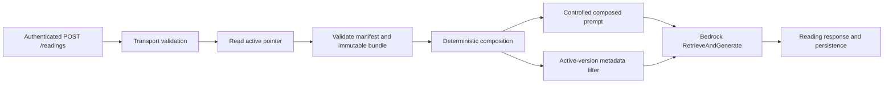

# Deterministic Composer Runtime

## Purpose

The development API composes exact tarot context from an approved opaque corpus bundle before it
calls Amazon Bedrock. This runtime keeps canonical card, orientation, spread-position, and
relationship facts deterministic while retaining Bedrock Knowledge Bases for selective thematic
retrieval and generated prose.

Corpus sources, compilation, editorial rules, real fixtures, publication, activation, and
ingestion remain private. This public repository contains only the generic consumer contract,
validation, composition, AWS loading boundary, and runtime integration.

Explicit retrieval followed by a separate model invocation is not part of this implementation.
The API still uses Bedrock Agent Runtime `RetrieveAndGenerate`.

## Runtime ownership

The public API owns:

- strict compatibility validation for the active pointer, release manifest, and opaque composer
  bundle
- bounded S3 reads, checksum validation, immutable bundle caching, and fail-closed replacement
- deterministic request normalization, card-local composition, named positional relationships,
  and whole-spread relationships
- precedence-ordered prompt rendering and the exact active-corpus metadata filter
- safe errors, aggregate logs, response metadata, and persistence metadata

The private corpus workflow owns the meaning of the data supplied through that contract. Public
code must not reproduce its compiler, source schema, editorial logic, or real rules.

## Request flow



When composer mode is enabled, the route:

1. Validates the existing public request contract before any S3 access.
2. Reads the development active-release pointer on every request.
3. Validates same-stage Knowledge Base and data-source identities.
4. Loads or reuses one fully validated immutable bundle for the complete pointer identity.
5. Normalizes supported single-card or Celtic Cross input against exact bundle identities.
6. Composes card-local facts, declared named-position edges, and allowlisted whole-spread results.
7. Builds a controlled prompt in the approved evidence order.
8. Adds an `andAll` retrieval filter for the exact corpus version, approved status, and
   correspondence-theme document kind.
9. Calls the existing `RetrieveAndGenerateCommand` and maps its output normally.

The enabled path never falls back to an old bundle or the legacy prompt after a compatibility,
load, or composition failure.

## Consumer compatibility

The public consumer projection is intentionally narrower than the private artifact. It accepts
only known schema versions, exact fields, safe relative object paths, bounded object sizes,
lowercase SHA-256 identities, and allowlisted predicate and relationship types.

Spread positions use zero-based sequential `order` values. Celtic Cross requests must contain ten
items whose position IDs match that exact order. Card indexes resolve to one canonical card and the
submitted card name must match. A mismatch is a safe request-domain error, not a semantic search.

The loader reads only:

- `state/dev/active-release.json`
- `releases/*/manifest.json`
- `releases/*/composer-bundle.json`

It validates the immutable bundle byte size, SHA-256 checksum, schema, corpus version, and public
consumer projection before replacing its one-entry cache. The active pointer is read for every
enabled request; identical concurrent misses share one in-flight immutable load.

## Prompt precedence and retrieval

The composed prompt orders evidence as:

1. authority and non-contradiction instructions
2. active corpus and spread identity
3. ordered card, orientation, position, and exact-meaning context
4. declared named positional relationships
5. bounded whole-spread relationships
6. optional user intent
7. response-shape requirements

Retrieved text may enrich these exact facts but cannot replace or contradict them. Empty optional
relationship sections are omitted. Private source IDs and rule IDs are not rendered.

The Bedrock client still performs one `RetrieveAndGenerate` request per reading. Its optional
retrieval filter is omitted in disabled mode and set to the exact active corpus version in enabled
mode. Separate `Retrieve`, reranking, and independent model generation remain a future project.

## Configuration and deployment

Development is deployed with:

```text
BEDROCK_RUNTIME_MODE=bedrock
COMPOSER_RUNTIME_MODE=enabled
BEDROCK_CORPUS_BUCKET=<same-stage corpus bucket>
BEDROCK_DATA_SOURCE_ID=<same-stage data source>
BEDROCK_KNOWLEDGE_BASE_ID=<same-stage Knowledge Base>
```

Production and local Bedrock-disabled operation use `COMPOSER_RUNTIME_MODE=disabled`. Local mode
does not construct the composer S3 reader and continues to use the legacy prompt. Production has
no composer object-read grant.

The development Lambda role has `s3:GetObject` only for the three patterns listed under consumer
compatibility. The Bedrock stack exports the bucket and data-source identities consumed by the API
stack through strong CloudFormation references.

## Errors, logs, and persistence

Unsupported card or spread selections return HTTP 400:

```json
{"code":"INVALID_COMPOSER_REQUEST","message":"The reading selection is not supported by the active tarot corpus."}
```

Artifact, configuration, identity, integrity, or load failures return a retryable HTTP 503:

```json
{"code":"COMPOSER_UNAVAILABLE","message":"Tarot reading context is temporarily unavailable.","retryable":true}
```

Responses and DynamoDB generation metadata expose only:

- `composerMode`
- optional `corpusVersion`
- optional `namedPairCount`
- optional `wholeSpreadCount`

They never persist composed cards, prompts, themes, relationship facts, support lists, source IDs,
or rule IDs. Runtime logs use request IDs, timing, corpus version, prompt length, card count, and
aggregate result/citation counts. Authorization is redacted and request bodies are not logged.

## Operations and verification

Before a development deployment:

1. Run API and infrastructure tests, type builds, lint, and `git diff --check`.
2. Review the exact `SimpleTarotDev/*` CDK diff.
3. Confirm production has no changes.
4. Confirm composer IAM contains only the three approved S3 object patterns.
5. Obtain explicit authorization for the exact development targets.

After deployment, inspect selected Lambda environment fields and the synthesized IAM statement,
then run authenticated single-card and Celtic Cross cases. Record only request IDs, status,
response-shape validity, composer mode, corpus version, item and relationship counts, and citation
count. Compare the returned version with the active pointer without committing or printing artifact
bodies.

The 2026-07-18 development activation verified both supported spreads, safe invalid-selection and
invalid-order 400 responses, exact active-version metadata, aggregate-only logs, and continued
`RetrieveAndGenerate` use. Production was not deployed.

## Rollback

The runtime rollback is configuration-based:

1. Set development composer mode to disabled in the reviewed infrastructure definition.
2. Generate and review the development CDK diff.
3. Confirm it removes the bucket/data-source environment identities, the three S3 read patterns,
   and their dependent exports.
4. Deploy only after exact-target authorization.
5. Verify the legacy prompt path with the existing disabled-mode route tests and a valid reading.

Disabling composer mode does not mutate the active corpus release, delete the Knowledge Base, or
change the vector data source. Restoring enabled mode requires a new reviewed diff and explicit
authorization.
