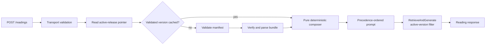

# Deterministic Composer Runtime — Design

## Status

Approved section by section in design discussion on 2026-07-18. This written specification awaits
final user review before implementation planning begins.

## Objective

Load the active private composer bundle into the public development API, validate it as an opaque
versioned artifact, compute exact card and relationship context deterministically, and use that
context in the existing Bedrock `RetrieveAndGenerate` path.

This stage improves development readings without changing the public request contract or production.
Replacing `RetrieveAndGenerate` with separate retrieval and generation is a later project.

## Scope

This project includes:

- development-only composer-bundle loading from the existing private corpus bucket
- public compatibility, integrity, path, and size validation
- a generic public predicate and relationship evaluator driven by private bundle data
- exact single-card and Celtic Cross composition
- deterministic prompt construction and active-version retrieval filters
- a development rollout switch with explicit legacy-prompt rollback
- additive response metadata, safe observability, automated tests, live verification, and docs

This project excludes private source/compiler/rule content in public Git, executable rules, a
private runtime service or package, a harness UI, explicit `Retrieve`, separate model invocation,
custom retrieval-query construction, reranking, production enablement, and editorial changes.

## Current State

Development has an active selective-RAG release with native filterable metadata and `NONE`
chunking. Its activation pointer is written only after ingestion completes without failure reasons
or failed documents.

The public API still builds a prompt directly from request fields and sends it to
`RetrieveAndGenerate`. It has no S3 composer read path, consumer validator, cache, or composition
engine. The current mobile flow sends one `single_card` item with presentation position `guidance`;
the private bundle treats single-card readings as position-less and defines Celtic Cross as its
multi-card spread.

## Chosen Architecture

Use the successful activation record as the runtime pointer and immutable releases as composer data.



Packaging the bundle with Lambda was rejected because corpus activation would require a public API
build and could drift from the Knowledge Base. A private package/service was rejected because it
adds publishing or networking, credentials, coordination, and another failure boundary. The public
evaluator is generic; proprietary facts, rules, thresholds, and content stay in the bundle.

## Ownership and Location

The private workflow remains the only writer and owns source content, compilation, release,
activation, and rollback. The public repository owns only the consumer contract, S3 reads,
compatibility checks, generic evaluation, API orchestration, prompt rendering, and IAM.

Focused server-only modules live under `apps/api/src/composer/`. They do not enter `packages/ui` or
`packages/hooks`: clients share the capability through the API and never receive AWS credentials or
private runtime artifacts.

## Runtime Configuration

Add:

```ts
type ComposerRuntimeMode = 'disabled' | 'enabled';
```

Environment values are `COMPOSER_RUNTIME_MODE`, `BEDROCK_CORPUS_BUCKET`, and
`BEDROCK_DATA_SOURCE_ID`. Local mode defaults disabled and performs no S3 reads. Development deploys
enabled with same-stage identities. Production deploys disabled and receives no composer read grant.
Missing composer configuration fails startup only when Bedrock and composer modes are enabled.

Typed initial limits are two themes per card, four named-pair results, and three whole-spread
results. They belong to API configuration, not the private corpus schema.

## Pointer, Manifest, and Bundle Loading

Every enabled Bedrock request reads `state/dev/active-release.json`. Validate state schema `1`,
environment `dev`, a lowercase 64-character corpus version, release prefix exactly
`releases/<corpusVersion>/`, configured Knowledge Base and data-source agreement, a non-empty job ID,
and a valid completion timestamp. The API never chooses a release by listing S3.

On a cache miss, load the referenced manifest and validate this consumer projection:

- manifest schema `1` and corpus schema `1`
- matching corpus version
- safe relative paths
- `runtimeObjects` contains only `composer-bundle.json`
- a JSON composer entry with positive byte size at most 2 MiB and lowercase SHA-256

Load `composer-bundle.json` with a 2 MiB bound; verify exact byte length and checksum before parsing.
The parsed bundle must have schema `1`, the matching corpus version, required maps/arrays and
primitives, allowlisted predicates/relationship types, and no executable values. Public validation
protects runtime compatibility without reproducing compiler validation or interpreting provenance.

## Cache and Concurrency

The warm Lambda holds one validated entry keyed by complete pointer identity. Every request still
reads the pointer.

- A matching pointer returns the cache without rereading immutable objects.
- A new pointer loads fully before replacing the cache.
- A failed new load does not use the old version or silently fall back; a later request may retry.
- Concurrent misses for the same pointer share one in-flight promise.
- One request uses one bundle snapshot through composition and generation.

## Infrastructure and IAM

The Bedrock stack exposes the corpus bucket and selected data source to the same-stage API stack.
Development passes their identities to Lambda and grants `s3:GetObject` only for:

- `state/dev/active-release.json`
- `releases/*/manifest.json`
- `releases/*/composer-bundle.json`

Lambda gets no list, write, copy, delete, publication, or activation permission. Production gets no
composer S3 grant. Strong cross-stack references remain so resource replacement updates Lambda.

## Public Consumer Contract

The public schema contains only fields needed to validate and execute the generic contract:

- schema/corpus versions
- cards keyed by ID with identity, description, orientation keywords, correspondence IDs, and
  primitive attributes
- spreads keyed by ID with ordered positions and declared narrative edges
- correspondences keyed by ID
- approved theme fragments with typed predicates
- relationship rules with typed conditions, priority, and fact
- exact position meanings keyed by spread, position, card, and orientation

Sanitized tests use invented cards, facts, and rule IDs. Real private artifacts never enter Git,
logs, snapshots, error responses, or public fixtures.

## Request Normalization

Transport validation remains first. Composer domain validation follows loading.

For `single_card`, require one item, resolve by `cardIndex`, require exact canonical `cardName`, keep
the public position for response compatibility, treat it as non-canonical, and compose card-local
context only.

For Celtic Cross, accept public `celtic_cross` and bundle `celtic-cross`, normalize internally,
require ten ordered items matching the bundle's exact position order, and reject missing, duplicate,
unknown, or out-of-order positions. Resolve each card by index and require its name to match. No
fuzzy matching is allowed.

## Predicate Evaluation

The pure recursive evaluator accepts only `eq`, `in`, `all`, `any`, and `not`. Fields must use the
allowlisted `card.` namespace. Values resolve from explicit identity fields, primitive attributes,
or a referenced correspondence whose kind matches the field. Unknown fields do not match. The
evaluator never traverses arbitrary paths or executes bundle code.

## Card-Local Composition

Each context includes canonical ID/index/name/title/arcana/description, orientation, selected
orientation keywords, Celtic Cross position definition/lens, an approved exact position meaning
when available, and at most two matching approved themes. Missing optional data is omitted.

Themes rank by earliest matching subject in canonical card correspondence order, then theme ID.

## Relationship Composition

Only declared relationships are evaluated; arbitrary pairs are forbidden.

Named-pair composition evaluates Celtic Cross narrative edges and rules naming those edges. Whole-
spread composition supports only element dominance, suit dominance, Major Arcana weight, number
repetition, and orientation balance. Results contain a stable result ID, private rule ID internally,
priority, fact, and supporting card/position references. Multi-value matches use value-qualified IDs.

Named pairs rank by descending priority then stable ID and cap at four. Whole-spread results use the
same order and cap at three. Single-card mode emits neither category.

## Composed Output

```ts
type ComposedReadingContext = {
    corpusVersion: string;
    spreadMode: 'single-card' | 'celtic-cross';
    cards: ComposedCardContext[];
    namedPairResults: RelationshipResult[];
    wholeSpreadResults: RelationshipResult[];
};
```

The same request/bundle produces the same value. AWS, time, env, logging, and cache state remain
outside the composer. Facts and rule IDs stay in memory and tests; they are not logged or persisted.

## Prompt and Rollout

Composer-disabled mode calls the existing prompt builder unchanged. Enabled Bedrock mode loads,
composes, and renders controlled text. Local fixtures remain unchanged and never read S3.

Prompt precedence is:

1. authority and non-contradiction instructions
2. corpus version and normalized spread
3. exact ordered card contexts
4. named-pair facts
5. whole-spread facts
6. user question or general intent
7. response shape and mobile writing instructions

Exact facts are authoritative; Knowledge Base prose may enrich but not replace or contradict them.
Because this transition still uses one `RetrieveAndGenerate` input, composed content also affects
retrieval. Query/prompt separation belongs to the later explicit-retrieval project.

## Active-Version Retrieval Filter

Enabled mode adds an `andAll` filter requiring the loaded `corpusVersion`, `status = approved`, and
`documentKind = correspondence-theme`. Disabled rollback keeps current unfiltered behavior.

## Response and Persistence

Existing response fields remain. Add backward-compatible metadata:

- `composerMode: 'disabled' | 'enabled'`
- optional `corpusVersion`
- optional `namedPairCount`
- optional `wholeSpreadCount`

Reading history persists only these aggregate values, never context, prompt, facts, or rule IDs.

## Errors

Unknown/mismatched cards, unsupported spread, invalid Celtic Cross positions, or invalid item count
returns a typed 400 without exposing bundle data.

Missing config, unreadable S3, invalid pointer/path/schema/shape, manifest disagreement, checksum or
size mismatch, oversize, or corrupt JSON returns a typed retryable 503. Enabled mode never silently
uses legacy prompt or an older cached version. Operators explicitly disable the switch to roll back.
Bedrock failures keep existing retryable behavior. Missing optional themes/relationships is valid.

## Observability and Privacy

Safe logs may include request ID, mode, corpus version, cache phase/hit, load duration, card count,
aggregate relationship counts, and prompt length. They exclude questions, selections, prompts,
facts, themes, relationship text, rule IDs, artifact bodies, and non-contract private paths.

## Automated Verification

Loader tests cover valid loading; pointer identity mismatches; path safety; unsupported schemas;
missing/wrong/oversized/corrupt artifacts; checksum/size; per-request pointer reads; cache/version
changes; single-flight; and S3-to-503 mapping.

Composer tests cover single card; valid/invalid Celtic Cross; all predicate operators; field
allowlists; optional fallback; theme ordering/cap; named-edge-only evaluation; every whole-spread
type; ties; stable IDs; priority/caps; provenance; and deterministic output.

Integration tests cover prompt precedence/no JSON; unchanged disabled path; exact enabled filter;
unfiltered rollback; additive response/history metadata; 400/503 mapping; no local S3; safe logs;
development/prod config; scoped read-only IAM; and no stable Bedrock/production replacement.

## Live Development Verification

After an exact CDK diff and explicit deployment authorization:

- verify Lambda environment and IAM
- run a valid single-card and valid Celtic Cross request
- verify response corpus version equals active state
- verify aggregate counts without facts
- verify a domain-invalid request returns 400
- prove the disabled rollback template or deploy/verify it before restoring enabled
- confirm the API still uses `RetrieveAndGenerate`

No production deployment occurs.

## Implementation Checkpoints

1. Public contract, sanitized fixtures, predicate evaluator, and pure composer.
2. S3 loader/cache, configuration, and scoped infrastructure.
3. Prompt/route/Bedrock filter, metadata, development deployment, and rollback proof.
4. Live saved cases and public/private documentation reconciliation.

Each checkpoint completes tests, leaves files uncommitted, and stops. The user validates and commits
before authorizing the next checkpoint. AWS mutation needs separate exact-target authorization.

## Documentation

Implementation updates the root indexes, API/infra READMEs, public boundary, Bedrock integration and
operations docs, agent references, and the private artifact contract status. Completed architecture
gets a durable runtime document instead of relying on this planning spec.

## Rollback

The existing prompt builder and client stay intact. Rollback sets composer mode disabled and deploys
only the development API stack. It does not change the active release, Knowledge Base, data source,
vector index, or production. Artifact failure while enabled returns 503 until corrected or disabled.

## Success Criteria

- Valid requests resolve exact supported context deterministically.
- Composer and retrieved documents use one corpus version.
- Optional gaps never break readings.
- Internal relationships identify rule and supports without leaking them publicly.
- Warm requests do one pointer read and no immutable reread when unchanged.
- Corrupt/incompatible/mixed artifacts fail closed with retryable 503.
- Development uses composed prompts behind an explicit switch with legacy rollback.
- Production stays disabled and unchanged.
