# Private Retrieval-Evaluation Harness Design

**Date:** 2026-07-20
**Status:** Approved for implementation planning

## Purpose

Simple Tarot now performs deterministic composition, one filtered Amazon Bedrock Knowledge Base
retrieval, bounded evidence preparation, and one Converse generation call. Normal API responses
intentionally hide the internal evidence and prompt, which makes the mobile contract safe and
stable but makes corpus quality difficult to evaluate.

This design adds a small development-only evaluation surface to the public API and a private
command-line harness. The evaluation path runs the same application pipeline as a normal reading,
then returns the exact reading-specific context, retrieval evidence, and prompt needed to diagnose
retrieval and generation quality. The private harness records human feedback in versioned files so
corpus changes can be compared over time.

The evaluation boundary is deliberately practical rather than completely opaque. Any
authenticated development user may call it. Production and normal mobile responses remain
unchanged.

## Goals

- Evaluate the exact development runtime rather than reimplementing retrieval or prompt logic.
- Inspect the resolved composer context used for one reading without returning the entire bundle.
- Inspect the retrieval query, filter, ranked scores, bounded text, and prompt sent to Converse.
- Label each result for relevance and rate the generated reading for faithfulness, specificity,
  coherence, and richness.
- Commit private evaluation records for manual comparison across active corpus versions.
- Keep normal readings, persistence, logs, production, and corpus activation behavior unchanged.
- Prefer small focused functions shared by both routes over duplicated orchestration.

## Non-goals

- A web dashboard or mobile evaluation UI.
- Automatic corpus rewriting, recommendations, vector editing, or fine-tuning.
- Reranking, score thresholds, query rewriting, or structured model output.
- Evaluating or activating an inactive corpus release.
- Saving evaluation evidence in DynamoDB or S3 API logs.
- Returning the full active composer bundle or unrelated card, spread, theme, or rule content.
- New AWS data stores, IAM permissions, or production deployment.
- Automated cross-run scoring or comparison reports.

## Chosen Architecture

The design uses one shared reading-execution pipeline with two thin HTTP routes.

```mermaid
flowchart LR
    Request["Validated reading request"]
    Compose["Resolve active composer context"]
    Retrieve["Build query and Retrieve"]
    Evidence["Build bounded evidence"]
    Prompt["Assemble system and user prompt"]
    Converse["Converse"]
    Execution["Internal reading execution result"]
    Normal["POST /readings"]
    Evaluation["POST /reading-evaluations"]
    History["Normal response and persistence"]
    Trace["Evaluation response without persistence"]
    Harness["Private interactive CLI"]
    Record["Committed private evaluation record"]

    Request --> Compose
    Compose --> Retrieve
    Retrieve --> Evidence
    Compose --> Prompt
    Evidence --> Prompt
    Prompt --> Converse
    Converse --> Execution
    Execution --> Normal
    Execution --> Evaluation
    Normal --> History
    Evaluation --> Trace
    Trace --> Harness
    Harness --> Record
```



The shared execution result contains the generated reading and an internal trace. A normal route
maps and persists the existing public response, then discards the trace. The evaluation route
serializes the trace and never invokes reading-history persistence. This adds no Bedrock calls and
does not create a second implementation of composition, query construction, filtering, evidence
budgets, prompt assembly, or generation.

The alternative designs were rejected:

- An evaluation flag on `POST /readings` would mix response and persistence policies in one route
  and make accidental trace exposure more likely.
- Direct AWS calls from the private harness would duplicate public runtime behavior and allow the
  harness to drift from the application it is meant to evaluate.

## Public API Boundary

### Availability and authentication

The API exposes `POST /reading-evaluations` only when
`EVALUATION_RUNTIME_MODE=enabled`. The infrastructure definition sets this value only on the
development API. Production and local defaults omit the route and return 404.

Enabled evaluation mode requires all of the following at startup:

- Cognito authentication mode;
- Bedrock runtime mode;
- deterministic composer mode enabled; and
- the existing valid Bedrock and composer configuration.

The route uses the existing Cognito authentication middleware. Any authenticated development user
may call it; version 1 adds no operator group, allowlist, API key, or second secret.

### Request

The request body is the existing `ReadingRequest`. Validation, supported spreads, exact card
identity, position ordering, and safe domain errors are identical to `POST /readings`.

### Response

The response is a versioned `ReadingEvaluationResponse`:

```ts
type ReadingEvaluationResponse = {
    schemaVersion: 1;
    evaluatedAt: string;
    requestId: string;
    corpusVersion: string;
    reading: ReadingResponse;
    trace: {
        resolvedContext: ComposedReadingContext;
        retrieval: RetrievalEvaluationTrace;
        prompt: {
            system: string;
            user: string;
        };
        generation: GenerationEvaluationTrace;
    };
};
```

`resolvedContext` is the exact reading-specific `ComposedReadingContext`: resolved cards,
orientation and position facts, exact meanings, applicable themes, and emitted named-pair and
whole-spread relationship results. It may include the theme and rule identifiers already present
in that context. It never includes the full bundle or content unrelated to the reading.

The retrieval trace contains:

```ts
type RetrievalEvaluationResult = {
    rank: number;
    score?: number;
    documentId?: string;
    candidateText: string;
    candidateCharacterCount: number;
    evidenceText: string;
    evidenceCharacterCount: number;
    includedInPrompt: boolean;
    truncatedByResultLimit: boolean;
    truncatedByTotalLimit: boolean;
};

type RetrievalEvaluationTrace = {
    query: string;
    filter: {
        corpusVersion: string;
        status: "approved";
        documentKind: "correspondence-theme";
    };
    requestedResultCount: number;
    returnedResultCount: number;
    usableResultCount: number;
    totalEvidenceCharacters: number;
    durationMs: number;
    results: RetrievalEvaluationResult[];
};
```

`candidateText` is the trimmed text capped by the existing 2,000-character per-result limit.
`evidenceText` is the exact portion included after applying the existing 8,000-character total
limit. This preserves all five bounded candidates for relevance review while showing precisely
what influenced the prompt.

`documentId` is normalized from the terminal `.txt` filename in a supported Bedrock S3 location.
An absent or unsupported location produces no document ID; it does not fail the reading. The API
does not return the raw S3 URI or unrelated Bedrock metadata.

The generation trace contains the configured model or inference-profile identity, stop reason,
input and output token counts when supplied by Bedrock, output character count, and generation
duration. The complete system and user messages are returned exactly as sent to Converse.

### Normal response and persistence

`POST /readings`, `ReadingResponse`, reading history, failed-attempt persistence, and the empty
public citations array do not change. The normal route receives the shared internal execution
result but neither serializes nor persists its evaluation trace.

`POST /reading-evaluations` performs no successful-reading save, failed-attempt save, user-profile
update, or reading-history mutation. Its S3 API log remains aggregate-only: request identity,
route, status, duration, and safe error fields. The request body, resolved context, query, scores,
retrieved text, prompt, and generated text never enter application logs or S3 API logs.

## Shared Runtime Components

The implementation will extract focused interfaces rather than place both behaviors in a larger
conditional route handler:

- A shared reading executor owns composition, explicit retrieval/generation, response mapping, and
  construction of the internal trace.
- The Knowledge Base result mapper preserves rank, optional score, and supported location long
  enough to build the evaluation trace.
- The evidence builder remains the single owner of per-result and total character budgets and
  returns evidence plus inclusion/truncation accounting.
- The prompt builder remains the single owner of the system and user messages.
- The Converse boundary returns generated text plus safe usage, timing, and stop metadata to the
  internal executor.
- The normal route owns DynamoDB and API-log persistence policy.
- The evaluation route owns only evaluation response serialization and aggregate API logging.

Pure mapping and validation functions remain independently testable. AWS clients, clocks,
authentication, persistence, and terminal input/output stay at explicit boundaries.

## Private Harness

### Saved cases

Committed saved cases live under `evaluations/cases/`. Each case contains:

```ts
type EvaluationCase = {
    schemaVersion: 1;
    id: string;
    description?: string;
    request: ReadingRequest;
};
```

Case IDs are lowercase slugs and match their filenames. Cases contain public reading inputs only;
they do not contain credentials or AWS configuration.

### Interactive runner

The private repository exposes:

```sh
yarn evaluation:run --case <case-id>
```

The command reads the development API URL and Cognito access token from environment variables.
The access token is sent only in the Authorization header and is never printed or written to a
record. The runner:

1. validates and loads the saved case;
2. calls the development evaluation endpoint;
3. displays the generated reading, resolved context, ranked results, scores, candidate and
   evidence text, and full prompt;
4. prompts for `relevant`, `irrelevant`, or `unsure` for every returned result;
5. prompts for 1–5 faithfulness, specificity, coherence, and richness ratings;
6. accepts one optional short note; and
7. validates and writes the completed record once.

A failed API call prints the safe response and creates no completed record. Interrupting or
failing feedback validation also creates no completed record.

### Committed runs

Completed runs live under:

```text
evaluations/runs/<case-id>/<corpus-version>/<UTC-timestamp>.json
```

The timestamp uses a filename-safe UTC representation. A run file is create-only and contains:

```ts
type EvaluationRun = {
    schemaVersion: 1;
    caseId: string;
    recordedAt: string;
    evaluation: ReadingEvaluationResponse;
    retrievalFeedback: Array<{
        rank: number;
        documentId?: string;
        relevance: "relevant" | "irrelevant" | "unsure";
    }>;
    ratings: {
        faithfulness: number;
        specificity: number;
        coherence: number;
        richness: number;
    };
    note?: string;
};
```

The private validator requires one feedback item for every returned rank, unique ranks, ratings
from 1 through 5, matching case and corpus identities, and valid nested API schemas. It rejects any
credential-shaped field. The complete evaluation trace is intentionally committed only in the
private repository.

Version 1 compares runs manually through the case-oriented directory and Git diffs. It does not
calculate aggregate scores or choose a preferred corpus version automatically.

## Active-Corpus Policy

The harness evaluates only the active development pointer and its matching Knowledge Base filter.
It cannot request an arbitrary corpus version, activate a release, start ingestion, publish
artifacts, or roll back. Historical comparison uses records captured while earlier releases were
active.

The API continues to verify that the composer bundle and retrieval filter use the same active
corpus version. The evaluation response reports that version so the private record is self-
describing.

## Error Behavior

- Evaluation route disabled: 404.
- Missing or invalid Cognito authentication: 401.
- Invalid reading transport or unsupported selection: existing safe 400 behavior.
- Bedrock throttling: existing safe 429 behavior.
- Composer, retrieval, or generation unavailable: existing retryable 503 behavior.
- Missing score or unsupported result location: preserve the result without that optional field.
- Zero retrieval results or zero usable evidence: return an empty result/evidence trace and still
  generate from deterministic context.
- Generation failure after successful retrieval: return the existing safe error; do not expose a
  partial evaluation trace or write a private run.
- Invalid case, feedback, rating, or output path collision: fail locally without overwriting a
  committed record.

## Overhead

The evaluation feature adds no extra retrieval or generation call. The normal path briefly retains
references to context, evidence, prompt, and safe metrics that already exist during execution, then
discards them. It does not serialize the trace for normal readings. Evaluation responses are
larger by design but remain bounded by the existing composer artifact validation and evidence
budgets.

The design adds no database, queue, cache, secret store, API key, Cognito group, or second AWS
client stack.

## Verification

### Public API

Automated tests cover:

- shared execution parity between the normal and evaluation routes;
- unchanged normal response and reading-history behavior;
- exact evaluation response schema and reading-specific context;
- retrieval rank, score, document-ID normalization, candidate/evidence text, and truncation flags;
- full system/user prompt equality with the messages sent to Converse;
- generation metrics and zero-result generation;
- no evaluation persistence or content-bearing logs;
- existing safe 400, 429, and 503 behavior; and
- route absence unless valid evaluation mode is enabled.

### Infrastructure

CDK tests assert that development alone receives `EVALUATION_RUNTIME_MODE=enabled`, production
does not expose evaluation mode, and no IAM statement or AWS resource is added. A reviewed
development diff should contain only the Lambda asset and its development environment setting.

### Private harness

Automated tests cover case parsing, API request construction, Authorization-header handling,
response parsing, interactive feedback validation, record path construction, create-only writes,
and explicit proof that tokens never enter output records.

### Manual development gate

After explicit deployment authorization:

1. run one authenticated evaluation case against development;
2. confirm the response corpus version matches the active pointer;
3. confirm ranked results, evidence, resolved context, and prompt match one runtime execution;
4. complete feedback and inspect the private committed record;
5. verify no evaluation reading or failed attempt was written to DynamoDB;
6. verify API and CloudWatch logs contain aggregate fields only;
7. run a normal mobile reading and confirm its response/history contract is unchanged; and
8. confirm production and corpus resources were not changed.

## Rollback

Disable evaluation mode in the development infrastructure definition and deploy the reviewed
Lambda/environment diff. This removes the route without changing the normal reading pipeline,
active corpus, Knowledge Base, data source, or private evaluation records. A corrected forward
deployment is preferred for defects in shared execution; redeploying the last known-good
application revision remains available.

## Documentation Impact

Implementation must update the root documentation index, API and infrastructure READMEs, durable
Bedrock runtime documentation, public agent references, and the private repository README and
harness operating instructions. Current-state documentation must distinguish normal public
responses from development evaluation responses and must not imply that evaluation data is
persisted by the API.

## Success Criteria

- A saved private case can run against the real active development pipeline with one API call.
- Normal and evaluation routes use the same composition, retrieval, evidence, prompt, and Converse
  functions.
- The evaluation response exposes the exact resolved context, bounded retrieval evidence, full
  prompt, generated reading, and safe metrics for that execution.
- Any authenticated development user can call the route; production cannot.
- Evaluation calls do not mutate reading history, user profiles, corpus state, or AWS resources.
- A complete, token-free, human-rated run can be validated and committed privately.
- Earlier committed runs remain usable for manual comparison after the active corpus changes.
